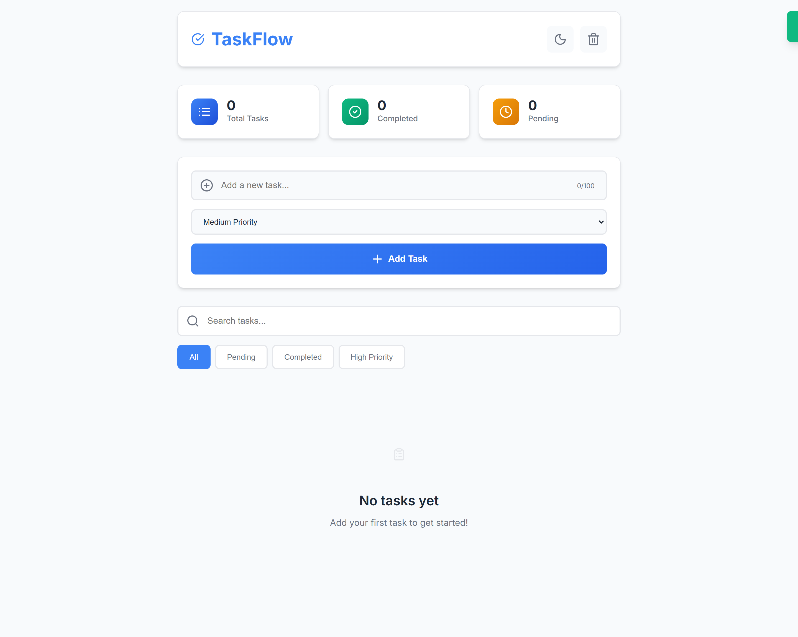
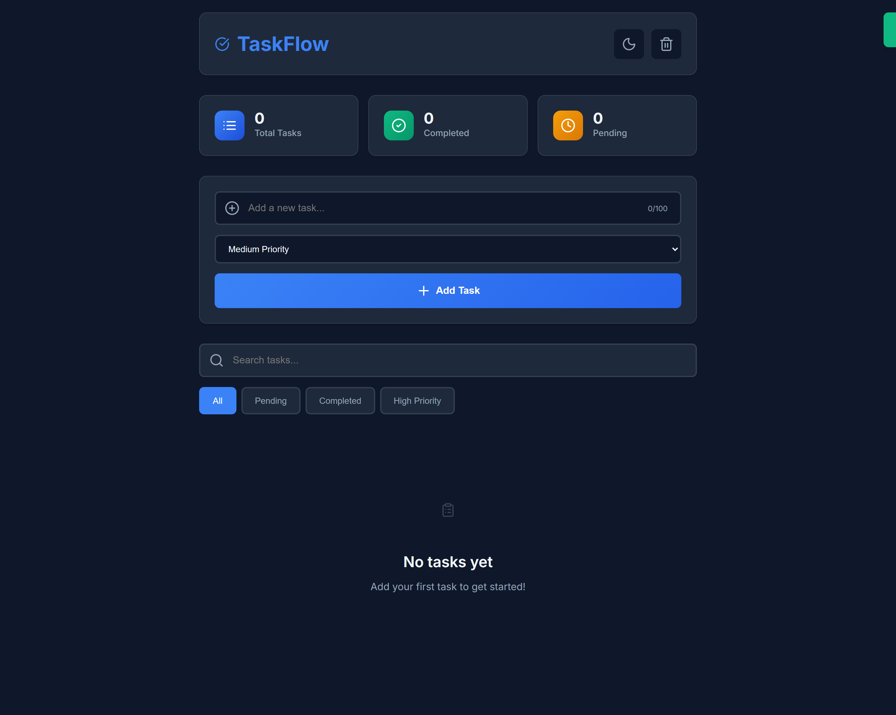

# TaskFlow - Modern Todo Application

<div align="center">
  <h3>🚀 A modern, feature-rich todo application built with vanilla JavaScript</h3>
  <p>Experience task management with style - Dark/Light themes, priority levels, and real-time statistics</p>

[](https://abdelrahman-samy-dev.github.io/taskflow-modern-todo/)
[](https://github.com/abdelrahman-samy-dev/taskflow-modern-todo)


</div>

---

## 📸 Preview

<div align="center">
  <table>
    <tr>
      <td align="center">
        <strong>🌞 Light Theme</strong><br/>
        
      </td>
      <td align="center">
        <strong>🌙 Dark Theme</strong><br/>
        
      </td>
    </tr>
  </table>
</div>

## ✨ Features

### 🎯 **Core Functionality**

- ✅ **Add/Delete Tasks** - Complete task management
- ✅ **Mark Complete/Incomplete** - Track task progress
- ✅ **Priority System** - High, Medium, Low priority levels
- ✅ **Real-time Search** - Instant task filtering
- ✅ **Smart Filters** - All, Pending, Completed, High Priority
- ✅ **Task Statistics** - Visual dashboard with counters

### 🎨 **User Experience**

- 🌙 **Theme Toggle** - Dark/Light mode with persistence
- 📱 **Fully Responsive** - Mobile-first design
- ⚡ **Smooth Animations** - Modern CSS transitions
- 🔔 **Toast Notifications** - User feedback system
- 🎭 **Loading Screens** - Enhanced UX
- 💫 **Empty States** - Intuitive guidance

### 💾 **Data Management**

- 💽 **Local Storage** - Persistent data
- 🔄 **Auto-save** - Real-time synchronization
- 📊 **Date Tracking** - Creation & completion timestamps
- 🛡️ **Error Handling** - Robust data management

## 🛠️ Tech Stack

| Technology            | Purpose                               |
| --------------------- | ------------------------------------- |
| **HTML5**             | Semantic structure and accessibility  |
| **CSS3**              | Modern styling with custom properties |
| **JavaScript (ES6+)** | Application logic and interactivity   |
| **Local Storage API** | Data persistence                      |
| **Lucide Icons**      | Beautiful, consistent iconography     |

## 🚀 Quick Start

### 1. Clone the Repository

```bash
git clone https://github.com/abdelrahman-samy-dev/taskflow-modern-todo.git
cd taskflow-modern-todo
```

### 2. Launch the App

```bash
# Option 1: Using Live Server (VS Code Extension)
# Right-click index.html → "Open with Live Server"

# Option 2: Using Python
python -m http.server 8000

# Option 3: Open directly in browser
# Double-click index.html
```

### 3. Start Managing Tasks! 🎉

## 💻 Usage Guide

### **Adding Tasks**

1. Type your task in the input field (max 100 characters)
2. Select priority level: Low, Medium, or High
3. Press Enter or click "Add Task"
4. Watch the character counter to stay within limits

### **Managing Tasks**

- **Complete Tasks**: Click the ✅ button
- **Delete Tasks**: Click the 🗑️ button (with confirmation)
- **Search Tasks**: Use the search bar for instant filtering
- **Filter Tasks**: Use buttons (All, Pending, Completed, High Priority)

### **Customization**

- **Theme**: Toggle between light/dark modes using 🌙/☀️
- **Clear All**: Remove all tasks with confirmation
- **Statistics**: View real-time task analytics

## 📁 Project Structure

```
taskflow-modern-todo/
├── index.html              # Main application file
├── README.md              # Project documentation
├── LICENSE                # MIT License
├── .gitignore            # Git ignore rules
└── screenshots/          # Project images
    ├── desktop-light.png
    ├── desktop-dark.png
    └── mobile-responsive.png
```

## 🎨 Key Technical Highlights

### **Modern JavaScript (ES6+)**

```javascript
class ModernTodoApp {
  constructor() {
    this.tasks = [];
    this.initializeApp();
    this.bindEvents();
  }

  // Class-based architecture for better organization
}
```

### **CSS Custom Properties for Theming**

```css
:root {
  --primary-color: #3b82f6;
  --background: #f8fafc;
  --surface: #ffffff;
}

[data-theme="dark"] {
  --background: #0f172a;
  --surface: #1e293b;
}
```

### **Responsive Design**

- Mobile-first approach
- Flexbox and CSS Grid layouts
- Breakpoints for tablet and desktop
- Touch-friendly interface elements

### **Performance Optimizations**

- Efficient DOM manipulation
- Event delegation for dynamic content
- Minimal reflows and repaints
- Optimized CSS animations

## 🔮 Future Enhancements

- [ ] **Task Categories** - Organize with custom tags
- [ ] **Due Dates** - Time-based task management
- [ ] **Drag & Drop** - Visual task reordering
- [ ] **Export/Import** - Data portability (JSON/CSV)
- [ ] **PWA Features** - Offline functionality
- [ ] **Multi-language** - Internationalization support

## 🤝 Contributing

Contributions make the open source community amazing! Any contributions are **greatly appreciated**.

1. Fork the Project
2. Create your Feature Branch (`git checkout -b feature/AmazingFeature`)
3. Commit your Changes (`git commit -m 'Add some AmazingFeature'`)
4. Push to the Branch (`git push origin feature/AmazingFeature`)
5. Open a Pull Request

## 📄 License

This project is licensed under the **MIT License** - see the [LICENSE](LICENSE) file for details.

## 👤 About the Developer

<div align="center">
  <table>
    <tr>
      <td align="center">
        
        <br/>
        <strong>Abdelrahman Samy Ali</strong>
        <br/>
        <em>Frontend Developer</em>
        <br/><br/>
        <a href="https://linkedin.com/in/abdelrahman-samy-ali">
          
        </a>
        <a href="https://github.com/abdelrahman-samy-dev">
          
        </a>
        <a href="mailto:abdelrahman.samy.dev@outlook.com">
          
        </a>
      </td>
    </tr>
  </table>
</div>

### 🎯 **Skills Demonstrated**

- Modern JavaScript (ES6+, Classes, Modules)
- Responsive Web Design (Mobile-first)
- CSS3 (Grid, Flexbox, Custom Properties)
- Local Storage & Browser APIs
- User Experience (UX) Design
- Clean Code & Architecture

## 🙏 Acknowledgments

- [Lucide Icons](https://lucide.dev) - Beautiful icon library
- [Inter Font](https://fonts.google.com/specimen/Inter) - Typography
- [Tailwind CSS](https://tailwindcss.com) - Color palette inspiration
- Modern web design trends and best practices

## ⭐ Show Support

If this project helped you, please consider:

- ⭐ **Star this repository**
- 🔄 **Share with others**
- 💡 **Contribute ideas**
- 🐛 **Report issues**

---

<div align="center">
  <p><strong>Made with ❤️ and lots of ☕</strong></p>
  <p><em>"Turning ideas into interactive experiences"</em></p>
  
  
  
</div>
